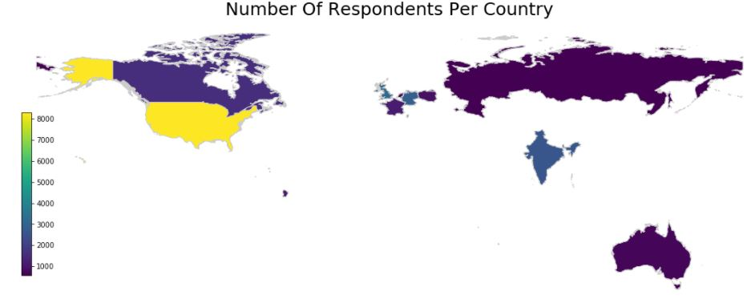
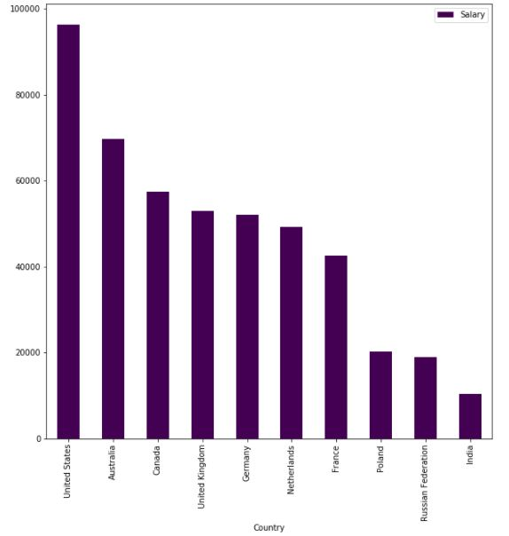
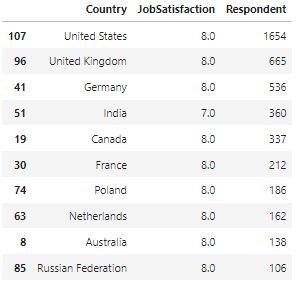
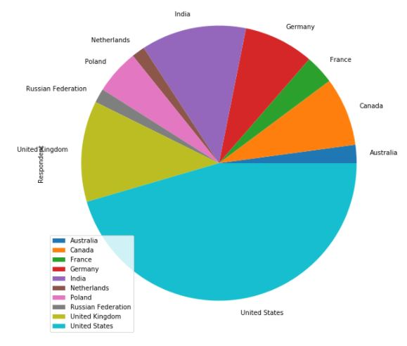

# Introduction 
In this project, we will attempt to answer some questions, 
based on a dataset provided by Stack Overflow. Every year, 
Stack Overflow conducts a massive survey of people on the site , 
covering all sorts of information like programming languages, salary, code style and various other information.

# Question I: What is the highest-paid country?
We select the top 10 countries which have the highest response rate 

Then we calculate the average salary per country:

 
From the above result, we notice that the top three highest average-salary countries are: United States, Australia, Canada 

#  Question II: which country has the highest satisfaction rate? 
This time we will focus on Job satisfaction in each country so we will use the corresponding columns which will answer the question  

Here we calculate the highest job satisfaction rate per response count   

  

Conclusion   
From the above result, we can conclude that the top three countries which have the highest satisfaction rate are : United States, United Kingdom, Germany 

# Question III:  Which country is most suited for females to work in?  

We will filter only Females from the Gender columns to answer this question  

  

Conclusion
Fom the above result, we can conclude that the top three countries: (United States, India, United Kingdom) have the highest response rate from females which might indicate that these countries are better suited for females to work in  

To see more about this analysis, see the link to my Github available [here](https://github.com/AmerM264/Udacity-Datascientist-Project/blob/main/Stack_Overflow_Analysis.ipynb).
